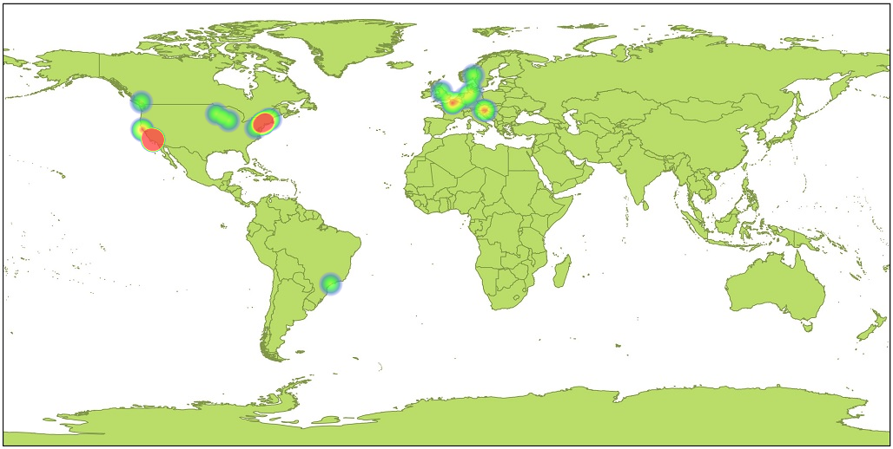

37 Greatest Albums of All Time
===========================
Albums are rated by how well they sound **when listened to from beginning to the end without interruptions**. That's the reason why there is no Nevermind by Nirvana or Rain Dogs by Tom Waits on the list, since they contain a few songs that ruin the flow of the record. There are also no live albums or compilations.

**Click on the cover to listen to the record on Youtube.**

### 37 | Fugazi, 'Repeater'  
_“Ultimate day record”_  
  

### 36 | Satyricon, 'Nemesis Divina'  
_“Great fusion of garage and studio production sounds”_  
  

### 35 | Nas, 'Illmatic'  
_“See cover”_  
  

### 34 | Manu Chao, 'Clandestino'  
_“Should have electronic beats, but computer bug erased them”_  
  

### 33 | Beck, 'Stereopathetic Soulmanure'  
_“Proper lo-fi americana trash”_  
  

### 32 | NoMeansNo, 'One'  
_“Their least annoying record”_  
  

### 31 | Pixies, 'Surfer Rosa'  
_“Drum room mics were delayed for 20 milliseconds”_  
  

### 30 | Devo, 'Are We Not Men? We Are Devo!'  
_“Wasted potential, but legendary material”_  
  

### 29 | Tom Waits, 'Franks Wild Years'  
_“High on life”_  
  

### 28 | Slint, 'Spiderland'  
_“More a song than an album”_  
  

### 27 | The Velvet Underground, 'The Velvet Underground'  
_“Ultimate night record”_  
  

### 26 | CSS, 'Cansei de Ser Sexy'  
_“Fun and relatable”_  
  

### 25 | Run the Jewels, 'Run the Jewels 2'  
_“Hardcore hip hop that is not based on trap”_  
  

### 24 | The Offspring, 'Smash'  
_“Best-selling independent label album of all time”_  
  

### 23 | Dicky B. Hardy, 'I Whistle - You Dance'  
_“Having no bass player can make your music more exciting”_  
  

### 22 | Beck, 'Midnite Vultures'  
_“Hitting the L.A.'s main nerve”_  
  

### 21 | St Germain, 'Tourist'  
_“A synthesis of electronics with jazz soloing”_  
  

### 20 | Primus, 'Brown Album'  
_“Kalamazoo is a real place in Michigan”_  
  

### 19 | Captain Beefheart, 'Safe as Milk'  
_“Beefheart for the masses”_  
  

### 18 | Tom Waits, 'Swordfishtrombones'  
_“Start of the Big Time era”_  
  

### 17 | Stooges, 'Funhouse'  
_“Stooges at their raw, sweaty, howling peak”_  
  

### 16 | Beastie Boys, 'Check Your Head'  
_“Better than the sum of its parts”_  
  

### 15 | The Tiger Lillies, 'Death and the Bible'  
_“Weimar, Brecht, Weill, the whole shtick”_  
  

### 14 | Nirvana, 'In Utero'  
_“Drum room mics were delayed for 20 milliseconds”_  
  

### 13 | Joy Division, 'Unknown Pleasures'  
_“Always better than you remember”_  
  

### 12 | New Bomb Turks, '!!Destroy-Oh-Boy!!'  
_“High octane punk 'n' roll”_  
  

### 11 | A Tribe Called Quest, 'The Low End Theory'  
_“They sound fresh even when rapping about pagers”_  
  

### 10 | Majke, 'Razdor'  
_“Dark and hopeful at the same time”_  
  

### 9 | Kendrick Lamar, 'To Pimp a Butterfly'  
_“Masterpiece”_  
  

### 8 | Ramones, 'Ramones'  
_“Divine intervention”_  
  

### 7 | Beck, 'Odelay'  
_“Vinyl crackling noises were added intentionally”_  
  

### 6 | The Velvet Underground, 'The Velvet Underground & Nico'  
_“Banana was peelable on early copies”_  
  

### 5 | The Doors, 'Morrison Hotel'  
_“Rothchild's best record”_  
  

### 4 | LCD Soundsystem, 'Sound of Silver'  
_“Dance-rock for failed hipsters”_  
  

### 3 | Tom Waits, 'Blue Valentine'  
_“Howe's best record”_  
  

### 2 | The Doors, 'L.A. Woman'  
_“Recorded live at their rehearsal space in six days with Elvis's bass player”_  
  

### 1 | Rage Against the Machine, 'Rage Against the Machine'  
_“No samples, keyboards or synthesizers were used in the making of this record”_  
  

Release Dates
------

Studio Locations
------

