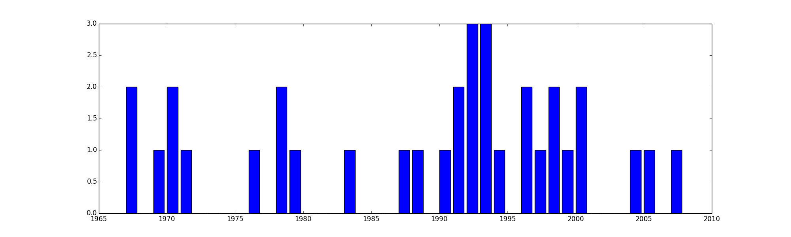

34 Greatest Albums of All Time
===========================
Albums are rated by how well they sound when listened to from beginning to the end without interruptions. That's the reason why there is no Nevermind by Nirvana or Rain Dogs by Tom Waits on the list, since they contain a few songs that ruin the flow of the record. There are also no live albums or compilations.

Click on the cover to listen to the record on Youtube.

#### 34 | Kyuss, 'Blues for the Red Sun'

#### 33 | Fugazi, 'Repeater'

#### 32 | Satyricon, 'Nemesis Divina'

#### 31 | Manu Chao, 'Clandestino'

#### 30 | NoMeansNo, 'One'

#### 29 | Pixies, 'Surfer Rosa'

#### 28 | Devo, 'Are We Not Men? We Are Devo!'

#### 27 | Tom Waits, 'Franks Wild Years'

#### 26 | Slint, 'Spiderland'

#### 25 | The Velvet Underground, 'The Velvet Underground'

#### 24 | CSS, 'Cansei de Ser Sexy'

#### 23 | The Offspring, 'Smash'

#### 22 | Dicky B. Hardy, 'I Whistle - You Dance'

#### 21 | Beck, 'Midnite Vultures'

#### 20 | St Germain, 'Tourist'

#### 19 | Primus, 'Brown Album'

#### 18 | Captain Beefheart, 'Safe as Milk'

#### 17 | Tom Waits, 'Swordfishtrombones'

#### 16 | Stooges, 'Funhouse'

#### 15 | Beastie Boys, 'Check Your Head'

#### 14 | The Tiger Lillies, 'Death and the Bible'

#### 13 | Nirvana, 'In Utero'

#### 12 | Joy Division, 'Unknown Pleasures'

#### 11 | New Bomb Turks, '!!Destroy-Oh-Boy!!'

#### 10 | A Tribe Called Quest, 'The Low End Theory'

#### 9 | Majke, 'Razdor'

#### 8 | Ramones, 'Ramones'

#### 7 | Beck, 'Odelay'

#### 6 | The Velvet Underground, 'The Velvet Underground & Nico'

#### 5 | The Doors, 'Morrison Hotel'

#### 4 | LCD Soundsystem, 'Sound of Silver'

#### 3 | Tom Waits, 'Blue Valentine'

#### 2 | The Doors, 'L.A. Woman'

#### 1 | Rage Against the Machine, 'Rage Against the Machine'

Yearly distribution
------
